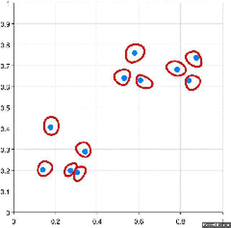
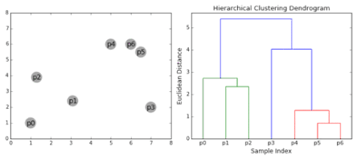
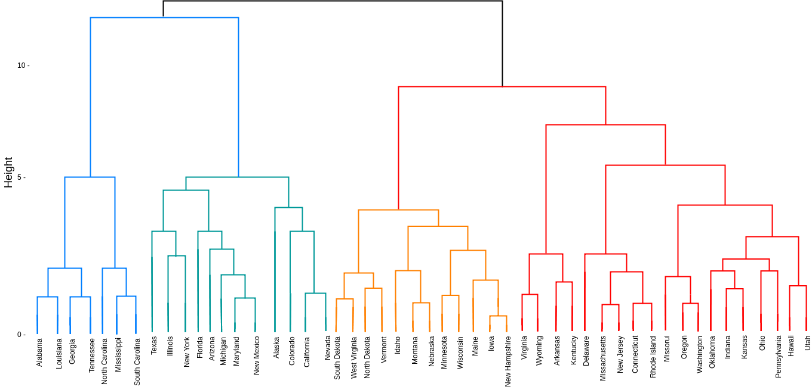

## What is it? 

An algorithm that groups together similar objects creating clusters starting with each observation as it's own group or ***cluster***. It repeats two steps:    

1. Identifies two closest clusters    
2. Merges those two clusters  
Until all clusters are merged into one. 

*For example*:  
  
^https://images.app.goo.gl/b2ibbtqejK3xd8kQ7^

The output of this clustering is usually a **dendrogram** which represents the *hierachical* relationship between the clusters. 

  
^https://images.app.goo.gl/GhuzA3RuHxYuzGbaA^  

#### Measures of distance (similarity)

First, distance is what is used to define the similarity between clusters. The metric of distance needs to be defined in a way the make sense for the specific data. E.g. If clustering Just-Eat bike locations, the travel time between locations could be used.

#### Linkage

Then linkage needs to be deterimined. This is where the distance should be measured from.  

- Single-Linkage  
  - The closest part of each cluster  
- Complete Linkage  
  - The furthest part of each cluster  
- Mean Linkage  
  - The middle of each cluster  
- Other defined connection  

#### Divisive Hierarchical Clustering

Start with all objects as one cluster and then splitting them into smaller clusters but this is rarely used in practice.

## Strengths

- Easy to understand
- Easy to do

## Weaknesses

- Rarely provides the best solution
- Dendrograms are commonly misinterpreted

  - {height="50%" width="50%"}
  
- Lack of theoretical basis for arbitrary decisions to:
  - Specifiy distance metric
  - Specifiy linkage
- Doesn't work well with:
  - Large data
  - Mixed data types
    - Sometimes it's not straightforward to define distance between data types, age & gender for example
  - Missing data